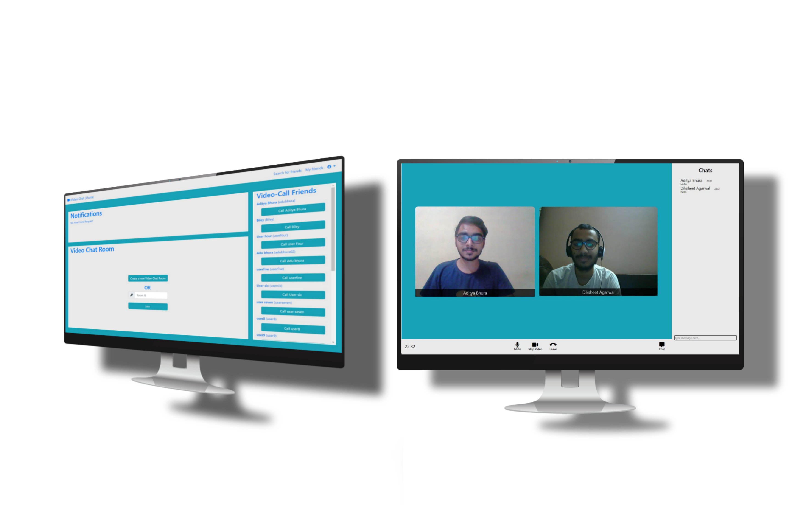

# Video_Chat_Website

<b>Video Chatting Website</b> is a video chatting website that makes interaction with friends and family via video chats pleasant. A user first needs sign up on the website and create his profile. A user can view and edit his profile any time after the account is created.  
A user can search for his family or friends by their names or by their unique handle names on the website and have look on their profile details. They can send them friend requests to add them to their friends list. A user can also cancel his sent friend request. A user can also accept or reject the friend request received. After they are added to the friends list the user can call the friends for a video call. The video call feature is for one-to-one video chatting along with text messages feature.  
This website is just not limited to one-to-one video chat feature but also video chat rooms. A user can create a video chat room and invite other people just by sharing the unique room id. A video chat room can have a maximum of 6 users. All the user in the room will receive notification whenever someone joins or leaves the video chat room. Names of the user will be displayed along with their video to have a great interaction. Text message feature is also available in the video chat room. 

# Running the Website locally
<ol>
<li>Open the root folder on the CLI</li>
<li>Run npm i -–save</li>
<li>Run npm start</li>
<li>The portal can now be accessed directly at localhost:3000</li>
</ol>
Website is currently live on : https://video-chat-app-by-bhura.herokuapp.com

# Screenshots

  

